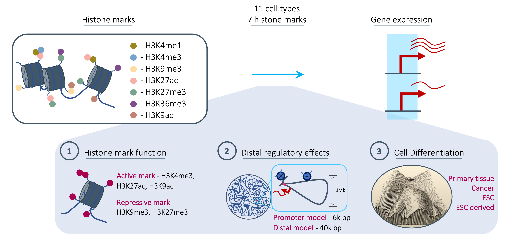

# epi_to_express

Which epigenetic factors are the best predictors of gene expression? An analysis using ROADMAP data.

[](./epi_to_express.png)


Multiple past approaches have tried to address which histone marks are most predictive of expression
but none have considered multiple histone marks, the distance of the regulatory effects and different
cell types. Here we address this issue and investigate the effect each plays on the most informative
histone marks. See our paper for full details.

## Reproducing results

The results of our work are based on two models a promoter model (epi_to_express - a custom convolutional 
neural network (CNN)) and a distal model ([chromoformer](https://www.nature.com/articles/s41467-022-34152-5)). 
We have separate conda enviornments and scripts to run the model training and evaluation for each and have 
split the repository by model. 

Roadmap data was used, specifically consolidated ChIP-seq read alignments and RPKM expression valuees for seven 
major histone marks:

* H3K4me1
* H3K4me3
* H3K9me3
* H3K27me3
* H3K36me3
* H3K27ac
* H3K9ac 

For 11 cell lines and tissue samples. Note that although the scripts and frameworks differ for the two models, 
the data used is the same across the two models so comparisons across them are valid.

Use the conda environments (yaml files in ./environments) for the steps:

```
conda env create -f ./environments/epi_to_express.yml && \
conda env create -f ./environments/chromoformer.yml && \
conda activate chromoformer && \
conda install pytorch==1.9.0 torchvision==0.10.0 torchaudio==0.9.0 torchmetrics=3.0.9 cudatoolkit=11.1 -c pytorch -c conda-forge
```

### 1. Download Data

Follow steps in [chromoformer](https://github.com/dohlee/chromoformer) repository embedded in this 
repository (`./chromoformer` folder) to download all data for model training an evaluation.

### 2. train the models

#### epi_to_express

Use `./train_run.py` or `./train_iter_run.py` to train the model for all cell types and histone marks for 4 fold
cross validation. Just pass in the cell and histone mark to train on.

#### chromoformer

Use `./train_run_chromoformer.py` or `./train_iter_run_chromoformer.py` to train the model for all cell types and
histone marks for 4 fold cross validation. Note that these scripts can also be used to train on combinations of 
histone marks by inputting these as a list.

### 3. Measure performance

#### epi_to_express

Use `./bin/test_epi_to_express.py` to test the model for all cell types and histone marks for 4 fold
cross validation.

#### chromoformer

Use `./bin/test_chromoformer.py` and `./bin/test_chromoformer_combns.py` to measure performance of the model for 
all cell types and histone marks for 4 fold cross validation. Note that `test_chromoformer_combns.py` is 
specifcally for the model trained to predict expression from two histone marks.

### 4. Histone mark activity

We evaluate the histone mark activity in the receptive field of the models. To rerun this analysis use the following:

#### epi_to_express

Use `./bin/epi_to_express_hist_mark_activity.py`. Note that this will get histone mark activity for all cell types, 
marks and genes not just those in the test set.

#### chromoformer

Use `./bin/chromoformer_hist_mark_activity.py`. Note that this will get histone mark activity for all cell types, 
marks and genes not just those in the test set.